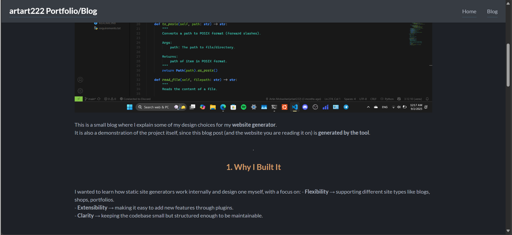

# Website Generator

A modular, pluggable static site generator built in Python. It transforms structured content (like Markdown) and data (YAML) into a full-featured, styled website using a flexible template engine. Designed for developers who want full control over their site's architecture and output.

> **Key Differentiator:** Unlike monolithic generators, this tool is built around a core processing pipeline. Its functionality is extended through dedicated **Engines** (e.g., Markdown, JSON processing) and **Plugins** (e.g., Sitemap generation, RSS feed), making it highly customizable and a great example of clean software architecture.

[My portfolio/blog built with this project](https://artart.dev)



> MIT Licensed. See [LICENSE](./LICENSE).

---

## ✨ Features

- **Modular core** with clear layers (`core/`, `processor/`, `utils/`) for maintainability.
- **Extensible** via `engines/` and `plugins/` directories so you can add or swap functionality without touching the core.
- **Theming & layout** using templates (see `templates/blog-template/`) and site-wide styles in `styles/`.
- **Single entry point**: run the generator from `main.py`.
- **Human-readable config** via `config.yaml`.

## 🚀 Quick Start

Get your website generated in under a minute.

```bash
# 1. Clone the repository
git clone https://github.com/artart222/website-generator.git
cd website-generator

# 2. Create and activate a virtual environment
python -m venv .venv
source .venv/bin/activate  # On Windows: .venv\Scripts\activate

# 3. Install dependencies
pip install -r requirements.txt

# 4. Configure your site
# Edit `config.yaml` to point to your content and template directories.
cp config.yaml config.yaml.backup  # Optional: backup the example config
nano config.yaml  # Or edit with your favorite text editor

# 5. Make your website contents in source/ directory

# 6. Run the generator!
python main.py

# Your static site will be built in the `output/` directory (or as configured).
```

## 🏗️ Project Structure

```
website-generator/
├── .github/                 # GitHub CI/CD workflows and configurations
├── core/                    # Core abstractions
├── engines/                 # Pluggable content processors
├── plugins/                 # Optional plugins
├── processor/               # Main processing pipeline orchestration
├── source/                  # INPUT: Raw content (Markdown, JSON, assets)
├── styles/                  # Global CSS, SCSS, and static assets
├── templates/
│   └── blog-template/       # Example theme using Django templates
├── utils/                   # Shared helper functions and utilities
├── .gitignore               # Git ignore rules
├── .pylintrc                # Pylint configuration
├── ARCHITECTURE.md          # High-level design documentation
├── config.yaml              # Main configuration file
├── LICENSE                  # MIT License
├── main.py                  # Application entry point
├── README.md                # This documentation
├── Demo Screenshot.png      # Screenshot of my website built with using this project
└── requirements.txt         # Python dependencies
```

## 🔧 How It Works & Technical Details

1.  **Configuration:** The `main.py` runs `projects.py` build function. The `projects.py` loads settings from `config.yaml` into a `Config` object.
2.  **Content Discovery:** The processor scans the `source/` directory for files.
3.  **Processing:** Each file is passed through its appropriate Engine (e.g., `.md` files → `MarkdownEngine`) to be converted into structured data and HTML.
4.  **Rendering:** Processed content is passed to Django templates, along with global site data, to render the final HTML pages.
5.  **Plugins:** In different phases of site building, different plugin hooks attach to the program to modify the website.
6.  **Output:** The final static website is written to the `output/` directory.

## 🛠️ Tech Stack:

* Language: Python 3.10+
* Templating: Django
* Content Parsing: PyYAML, Markdown
* Configuration: YAML

## 🤝 Contributing
This project is intentionally structured to be a learning tool and a foundation for others. Contributions are welcome!

1. Fork the Project

2. Create your Feature Branch (git checkout -b feature/AmazingFeature)

3. Commit your Changes (git commit -m 'Add some AmazingFeature')

4. Push to the Branch (git push origin feature/AmazingFeature)

5. Open a Pull Request

Please ensure your code follows existing styles and includes comments where necessary.

## 📝 License
Distributed under the MIT License. See LICENSE for more information.

## 🙋‍♂️ Why I Built This
I built this project to deepen my understanding of Python application architecture, design patterns like the pipeline pattern, and creating extensible, well-documented software. It serves as a practical demonstration of my ability to structure a non-trivial project from the ground up.
