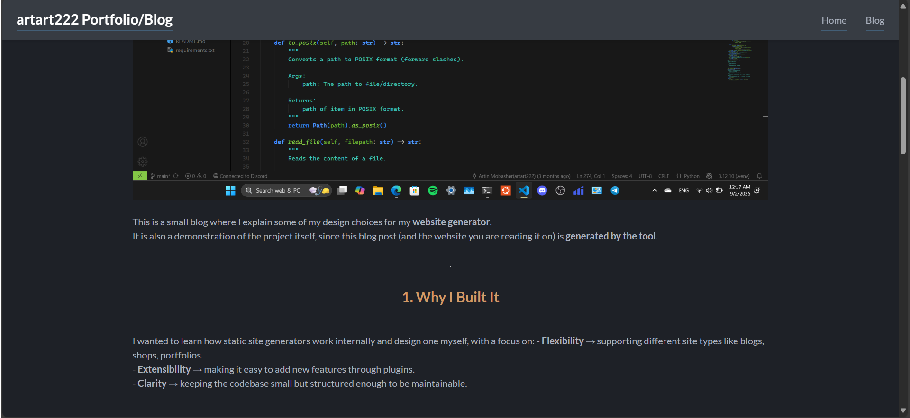

# Website Generator

Developer-first static site generator built in Python.

It turns Markdown content, YAML configuration, theme packages, and optional frontend tooling into a deployable static site in `output/`. The project is designed around collections, themes, and plugins so you can grow from a simple blog to a more customized portfolio, docs site, or content-heavy project without rewriting the core.



## What It Does

- Builds static HTML from Markdown files with front matter
- Organizes content through named collections such as `blog`, `pages`, or `shop`
- Renders pages with theme layouts, partials, and block templates
- Lets you override theme files locally through `site-theme/`
- Supports plugins for tasks like collection indexes, special pages, keywords, and sitemaps
- Can optionally export page data as JSON, build Tailwind CSS, and ship one collection as a static React app

## Quick Start

### 1. Install

```bash
git clone https://github.com/artart222/website-generator.git
cd website-generator
python -m venv .venv
```

Activate the virtual environment:

#### ***Windows:***

```powershell
.\.venv\Scripts\Activate.ps1
```

#### ***Linux/mac:***

```bash
source .venv/bin/activate
```

Install the package:

```bash
pip install -e .
```

If you want to run tests too:

```bash
pip install -e .[dev]
```

### 2. Build the included sample site

```bash
wg build
```

The generated site will be written to `output/`.

### 3. Preview locally

```bash
wg serve --build-first
```

Open `http://127.0.0.1:8000`.

### 4. Auto-rebuild while editing

```bash
wg watch
```

If you prefer not to install the CLI entry point, the same commands can be run with `python cli.py ...`.

## Start a New Site

Scaffold a fresh project:

```bash
wg init my-site
cd my-site
wg build
wg serve --build-first
```

The scaffold creates:

- `config.yaml`
- `theme.settings.yaml`
- `source/index.md`
- `source/blogs/hello-world.md`
- `site-theme/`

## CLI Commands

### Build and preview

```bash
wg build
wg serve --build-first
wg watch
```

### Create content

```bash
wg new page "About"
wg new post "Hello World"
wg new post "Release Notes" --slug release-notes
```

### Theme tools

```bash
wg theme create my-theme
wg theme inspect
wg theme eject partials/header.html
```

- `theme create` scaffolds a new theme under `themes/<name>/`
- `theme inspect` prints the active theme manifest as JSON
- `theme eject` copies one file from the active theme into `site-theme/` so you can override it locally

## Project Layout

```text
website-generator/
|-- cli.py
|-- config.yaml
|-- theme.settings.yaml
|-- source/
|   |-- index.md
|   `-- blogs/
|-- themes/
|-- site-theme/
|-- styles/
|-- output/
|-- docs/
`-- tests/
```

## Content Model

Content files are typically Markdown with YAML front matter.

Example:

```md
---
title: Hello World
summary: My first post.
date: 2026-03-22
type: blog
layout: document
tags:
  - python
  - static-site-generator
blocks:
  - type: hero
    content:
      title: Welcome
      text: Block-based sections can be rendered before the page body.
---

# Hello World

This is the Markdown body.
```

Collections in `config.yaml` decide where files live and how they route:

```yaml
content:
  collections:
    blog:
      path: ./source/blogs
      type: blog
      route:
        prefix: blog
      layout: document
      index:
        enabled: true
        layout: collection
        output_path: blog/index.html
        title: Blog
```

That setup generates post URLs under `/blog/<slug>/` and can also create a collection index page at `/blog/`.

## Configuration

The current config format is the nested v1 schema:

```yaml
version: 1

site:
  name: My Site
  description: Portfolio and blog
  base_url: https://example.com
  author: Your Name
  navigation:
    - title: Home
      type: index
    - title: Blog
      collection_index: blog

content:
  source_directory: ./source
  data_dir: ./source/data
  collections: {}

theme:
  name: minimal-blog
  settings: ./theme.settings.yaml
  site_theme_dir: ./site-theme

build:
  output_directory: ./output
  asset_dirs:
    - ./source/assets
  template_engine: django

plugins:
  - CollectionIndexerPlugin
  - SpecialPagesPlugin
  - SitemapPlugin

experimental:
  export_data:
    enabled: false
  react:
    enabled: false
  tailwind:
    enabled: false
```

Legacy flat config keys are still normalized internally, but new projects should use the v1 structure above.

## Themes and Overrides

Themes live in `themes/<theme-name>/` and declare:

- layouts such as `base`, `document`, `collection`, and `not_found`
- assets like theme CSS and static directories
- design tokens such as colors, typography, spacing, and radius
- supported block templates
- preset variants for reusable component styles

The active theme is selected in `config.yaml`:

```yaml
theme:
  name: minimal-blog
  settings: ./theme.settings.yaml
  site_theme_dir: ./site-theme
```

Theme settings are project-local and let you change presets or tokens without editing the theme package itself:

```yaml
preset: default
presets: {}
stylesheets: []
scripts: []
```

For one-off template or CSS overrides, put files in `site-theme/`. Files there take priority over the packaged theme. `wg theme eject` is the quickest way to copy a theme file into that override area.

Built-in themes currently included in this repo:

- `minimal-blog`
- `docs-basic`
- `editorial-ledger`
- `midnight-zine`
- `sunlit-notes`

## Optional Frontend Features

Tailwind and React export both require Node.js on your machine.

### JSON export

Enable page JSON output for headless or hybrid frontends:

```yaml
experimental:
  export_data:
    enabled: true
    output_dir: ./output/data
    include_collections: []
```

This writes `site.json` plus one `page.json` per generated page.

### Tailwind

Enable Tailwind compilation during the build:

```yaml
experimental:
  tailwind:
    enabled: true
    input: ./styles/tailwind.input.css
    output: ./styles/tailwind.css
    config: ./tailwind.config.js
    minify: false
```

### React export

One collection can be exported through the bundled Next.js app in `react-app/`:

```yaml
experimental:
  export_data:
    enabled: true
  react:
    enabled: true
    collection: shop
    app_dir: ./react-app
    export_subdir: shop
    base_path: /shop
    asset_prefix: /shop
```

React export requires `experimental.export_data.enabled: true` because the Next.js app reads the generated JSON payloads. This is intended for hybrid sites where most pages are static templates, but one section benefits from a React frontend.

## Development

Run tests:

```bash
pytest
```

Useful references:

- `docs/USER_GUIDE.md`
- `docs/DEVELOPER_GUIDE.md`
- `ARCHITECTURE.md`

## Tech Stack

- Python 3.10+
- Django templates
- Markdown
- PyYAML
- Optional Tailwind CSS
- Optional Next.js static export

## License

MIT. See `LICENSE`.
