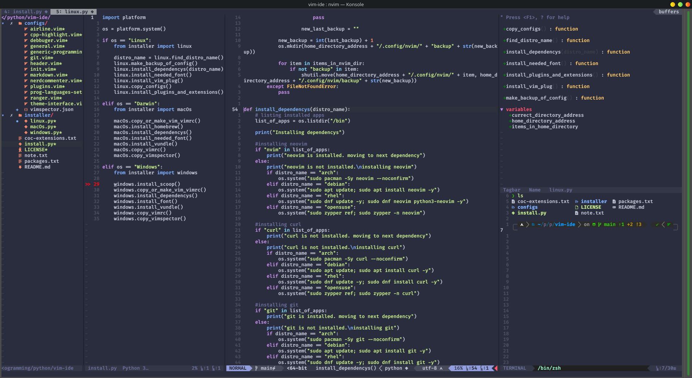

Title:   My Document
Title:   Your Document
Summary: A brief description of my document.
Authors: Artin
         Martin
Date:    October 2, 2007
blank-value:
base_url: http://example.com
type: blog
      eshop 
      game

This is the first paragraph of the document.

# Hi i'm h1

I'm HTML paraghrap

*[HTML]: Hyper Text Markup Language



``` python
with open("main.md", mode="r", encoding="utf-8") as markdow_file:
    markdow_text = markdow_file.read()
    # html_text = markdown.markdown(markdow_text, extensions=["extra"])
    # print(md_processor.process(markdow_text))
    with open("main.html", "w") as html_output:
        html_output.write(md_processor.process(markdow_text))
```

| Column 1      | Column 2      |
| ------------- | ------------- |
| Cell 1, Row 1 | Cell 2, Row 1 |
| Cell 1, Row 2 | Cell 1, Row 2 |